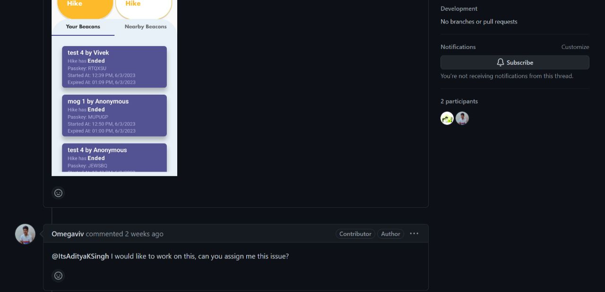
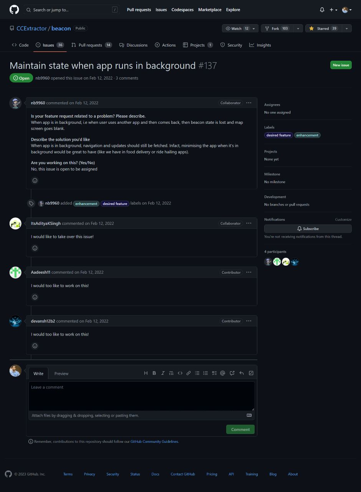
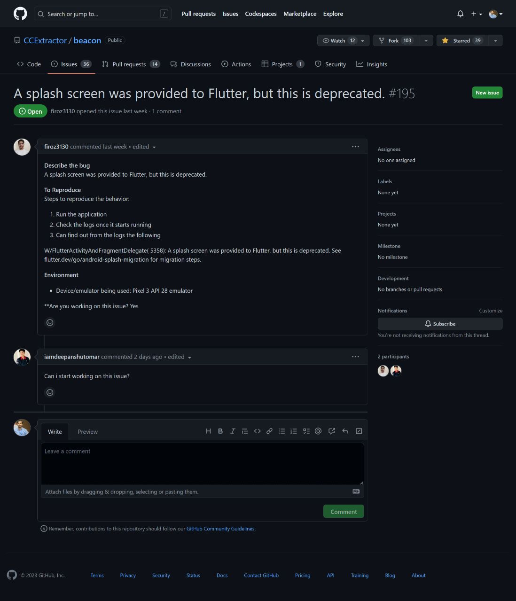
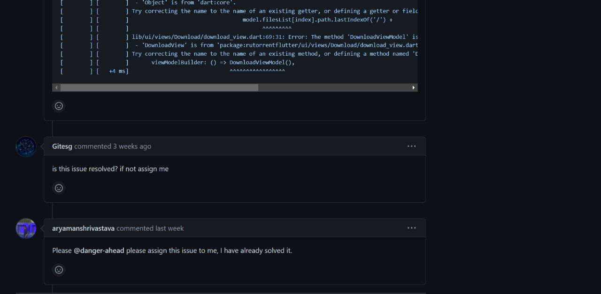
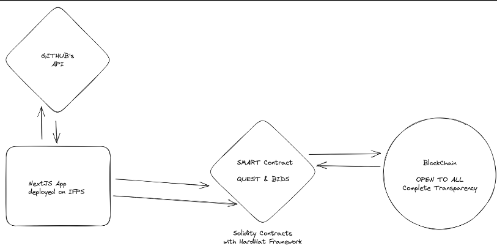

# cuesource

web 3 based decentralized platform which allows open-source organization to list their issues with a small reward/incentive range alongside a deadline and let the developers place a bid within amount and time required(deadline).

### the problem

---

Developers faces difficulty in finding good issues to work upon as most of the issue are assigned to someone and they didn’t complete their work on time, this leads to delay in solving of problem for both developer and organizations. Further, it is also important for organizations to find the best and serious developers to work upon their important and critical issue on their open-source products that is used by a lot of people.

Issue Assignment Requests | Issue Not Solved  
:-------------------------:|:-------------------------:
 |  
 | 

### the solution

---

> **web 3 based decentralized platform which allows open-source organization to list their issues with a small reward/incentive range alongside a deadline and let the developers place a bid within amount and time required(deadline).**

Our solution is a web 3 based decentralized platform which allows open-source organization to list their issues with a small reward range along with a deadline and let the developers place a bid with an amount and time required to solve the issue.

This helps the organization to find the right and most efficient developer for their important and critical issues. Also on the other hand it motivates the developers to work on the issues get some incentives and also complete their work on time.

### bidding, huh!

So we've come up with this Bidding System in our providing developers to organization solution, so that the organizations have choices to let them meet the best tool for their problem and also for developers to get the best deal they deserve.

### the workflow

---

### web3!?

---

One of the uses of web-3 in our solution/project is to maintain the transparency between developers and organizations. Also, with the help of smart contracts we have automated the process of creating and deployment of quests, Yes we call our listed issues as **Quests**. Every quest and bid can be created updated or deleted right form the smart contract itself as it is used as the primary database.

### license

---

The project is licensed under [MIT License](./LICENSE).
